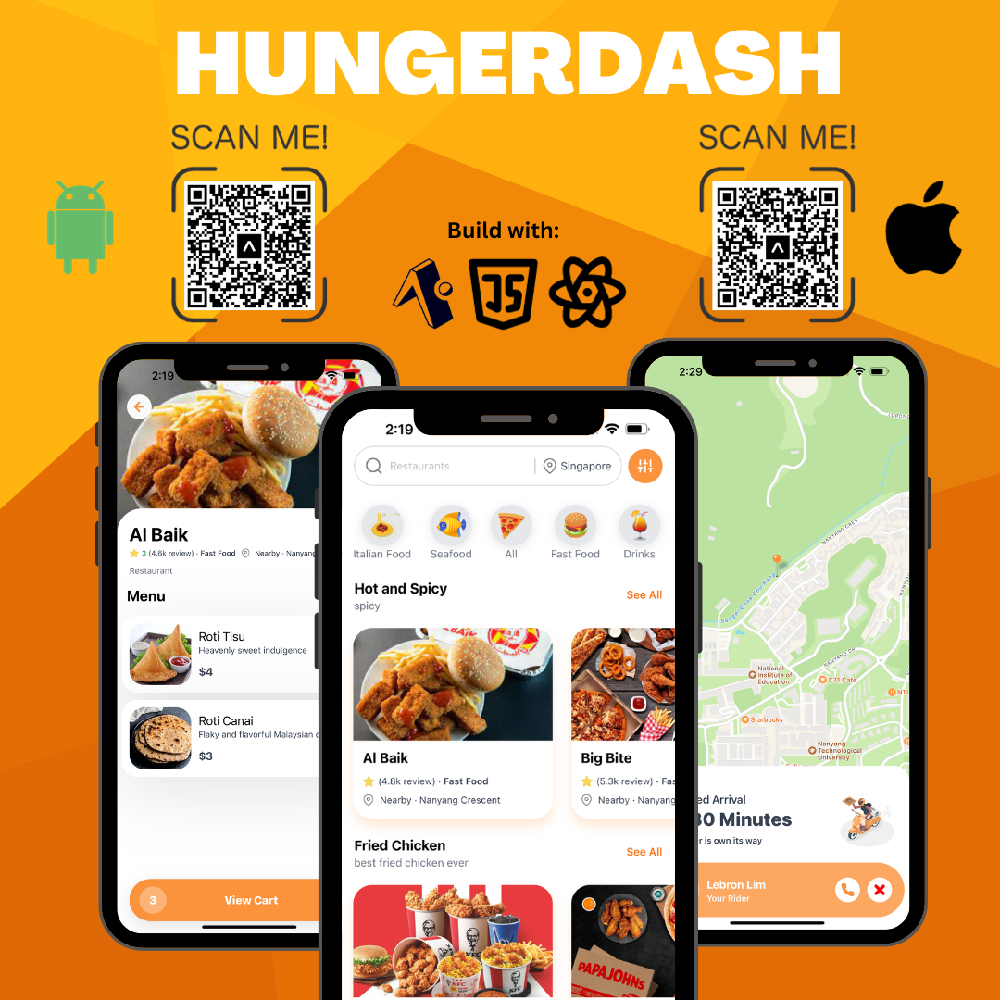

# HungerDash

---

# HungerDash Mobile App

HungerDash is a mobile food delivery application built with React Native and Expo. This app provides a seamless and user-friendly experience for customers to explore a variety of dishes, place orders, and have their favorite meals delivered to their doorstep.

## Features

-User-friendly Interface: Intuitive design for a smooth and enjoyable user experience.
-Diverse Menu: Explore a wide range of dishes from different cuisines.
-Order Tracking: Track the status of your order in real-time.

## Getting Started

Scan the QR code on my cover poster with your iOS/Android device
Download Expo Go App and enjoy the app rightaway!
   
Feel free to explore HungerDash and enjoy a delightful food delivery experience!
